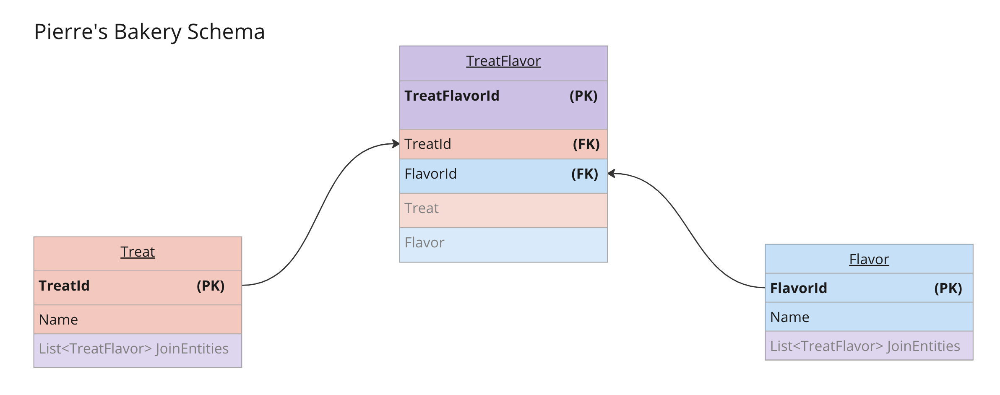

# _Pierre's Bakery with Identity Application_

#### By _Seth Gonzales_

#### _A C# / ASP.NET Core MVC application using Entity Framework Core and MySQL._

## Technologies Used

* C#
* .NET 6
* ASP.NET Core MVC
* Entity Framework Core
* MySQL
* MySQL Workbench

## Description

This application organizes and builds a repository of Treats and their Flavors, storing this information using a database. Users may create an account, log in and have access to full CRUD capabilities. Anonymous users may only view the home and detail pages of each treat and flavor. Logged in users may add new treats and flavors, select to see more specific details, edit or delete entries, and assign many treats to many flavors, and vice versa. This project follows object oriented design and object relational mapping, with the treat and flavor objects. This is an ASP.NET Core MVC application that uses Identity.
<p align="center">
  
</p>


## Setup and Installation Requirements

### Setting up the project
* Before starting, check that all required technologies are used. For more information on configuring [MySQL](https://dev.mysql.com/doc/mysql-installation-excerpt/5.7/en/) and [MySQLWorkbench](https://dev.mysql.com/doc/workbench/en/), follow the links provided.
* Navigate to the repository for Pierre's Bakery with Identity on [GitHub](https://github.com/sethgonzales/PierresIdentity.Solution).
* Clone the repository down using `$ git clone https://github.com/sethgonzales/PierresIdentity.Solution.git` in your terminal.
* Within the production directory `PierreIdentity`, create a new file called `appsettings.json`.
* Within `appsettings.json`, put in the following code, replacing the `database`, `uid`, and `pwd` values with your own database name, username, and password for MySQL.
```json
{
  "ConnectionStrings": {
      "DefaultConnection": "Server=localhost;Port=3306;database=YOUR_DATABASE;uid=YOUR_USERNAME;pwd=YOUR_PASSWORD;"
  }
}
```

### Setting up the database
* If not already configured, install the Entity Framework Core tool `dotnet-ef` using the command `$ dotnet tool install --global dotnet-ef --version 6.0.0` in your terminal. This will allow for data migrations and updates to the project's database.

### Running the project
* Navigate to this project's production directory `PierreIdentity`.
* Recreate the database by running the command `$ dotnet ef database update` in your terminal.
* Navigate to your MySQLWorkbench to double check that your database has been built without error.
* In the command line, run the command `$ dotnet run` or `$ dotnet watch run` to compile and execute the application.
   * To compile the application without running it, use the following command: `$ dotnet build`.
* Begin populating your database. Use navigational links for quick access to different pages.

## Known Bugs

* Viewing not suited for smaller screens.
* Animation on dropdown menu broken

## MIT License

Copyright (c) 2023 Seth Gonzales

Permission is hereby granted, free of charge, to any person obtaining a copy
of this software and associated documentation files (the "Software"), to deal
in the Software without restriction, including without limitation the rights
to use, copy, modify, merge, publish, distribute, sublicense, and/or sell
copies of the Software, and to permit persons to whom the Software is
furnished to do so, subject to the following conditions:

The above copyright notice and this permission notice shall be included in all
copies or substantial portions of the Software.

THE SOFTWARE IS PROVIDED "AS IS", WITHOUT WARRANTY OF ANY KIND, EXPRESS OR
IMPLIED, INCLUDING BUT NOT LIMITED TO THE WARRANTIES OF MERCHANTABILITY,
FITNESS FOR A PARTICULAR PURPOSE AND NONINFRINGEMENT. IN NO EVENT SHALL THE
AUTHORS OR COPYRIGHT HOLDERS BE LIABLE FOR ANY CLAIM, DAMAGES OR OTHER
LIABILITY, WHETHER IN AN ACTION OF CONTRACT, TORT OR OTHERWISE, ARISING FROM,
OUT OF OR IN CONNECTION WITH THE SOFTWARE OR THE USE OR OTHER DEALINGS IN THE
SOFTWARE.

## Contact Information

If you run into any issues, or would like to contribute to our code, please email: sethgonzales157@gmail.com.
